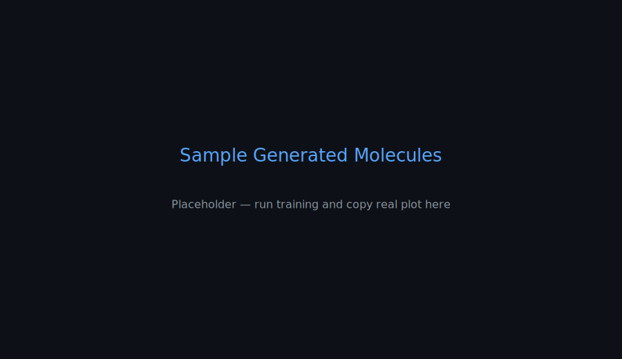
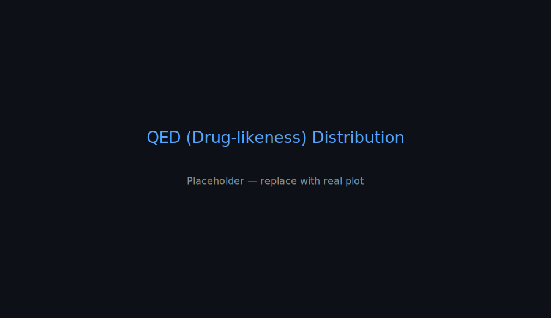
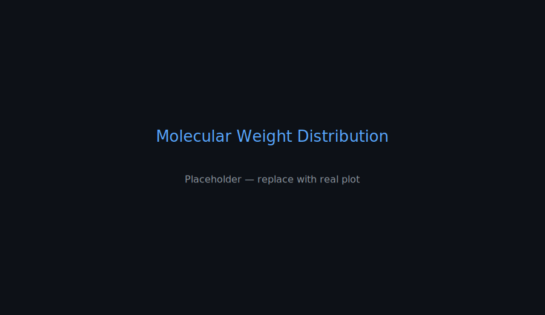
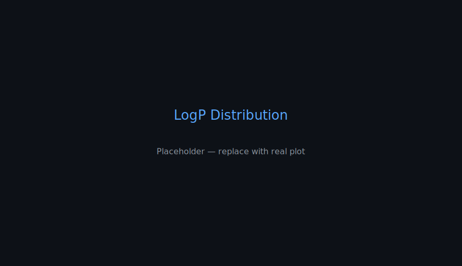
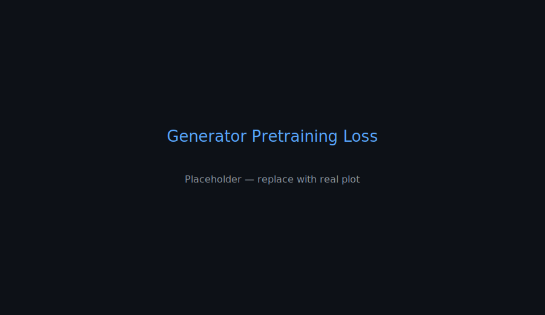
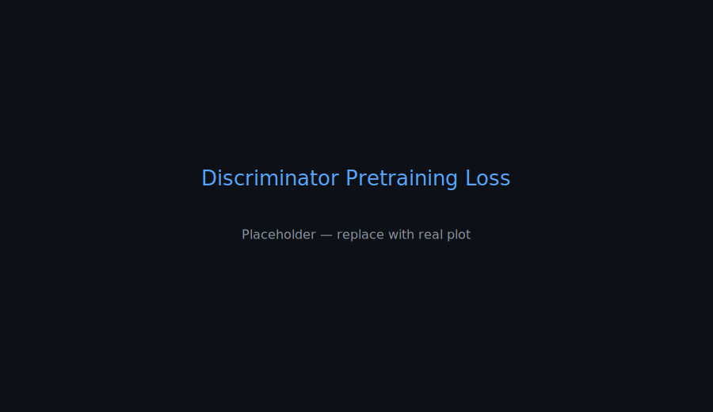
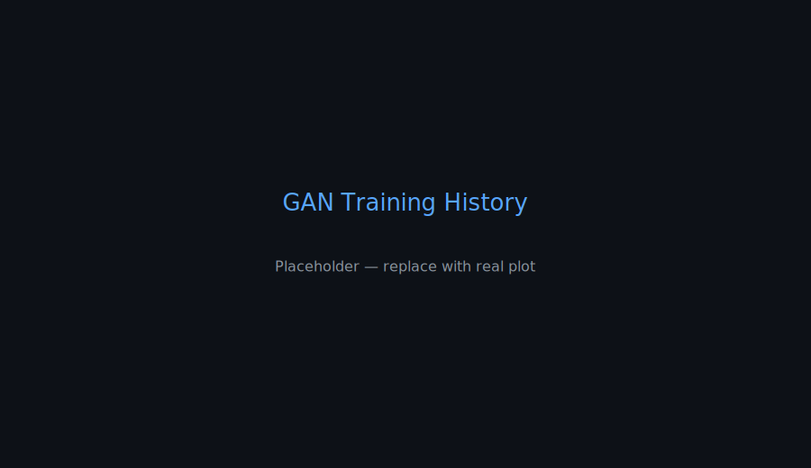

<p align="center">
  
  
  
</p>

<h1 align="center">🧬 Drug Discovery GAN</h1>
<p align="center"><b>Generate novel, valid, and diverse drug‑like molecules using GANs + Reinforcement Learning</b></p>
<p align="center"><sub>Project by <a href="https://github.com/Suprith-bit">Suprith-bit</a></sub></p>

---

## 🚀 Overview

Drug Discovery GAN is a research-grade, end-to-end pipeline for de novo molecule generation. It combines:
- A sequence-based Generator (SMILES) built with LSTMs,
- A Discriminator with CNN feature extraction and a dual-head design (real/fake + property prediction),
- A training loop that supports supervised pretraining and GAN training enhanced with reinforcement signals,
- Robust evaluation (validity, uniqueness, novelty) and rich visualizations.

Core stack: PyTorch, RDKit, NumPy, Pandas, Matplotlib.

---

## 🧭 Architecture at a Glance

```mermaid
flowchart LR
  A[SMILES Dataset] --> B[Preprocess & Tokenize (SMILESPreprocessor)]
  B --> C[Generator (LSTM) - SMILESGenerator]
  C --> D[Sample SMILES]
  D --> E[RDKit Validation / Canonicalization]
  E --> F[Discriminator (CNN + Property Head) - MolecularDiscriminator]
  F --> C
  F --> G[Metrics & Plots (Validity · Uniqueness · Novelty)]
```

---

## 🖼️ Visual Gallery

Images live in `assets/plots/` so they always display on GitHub. After runs, you can overwrite them using the script below.

<p align="center">
  
  
</p>
<p align="center">
  
  
</p>
<p align="center">
  
</p>

Training curves:
<p align="center">
  
  
</p>
<p align="center">
  
</p>

---

## 🗂️ Project Structure

```
src/
  ├── data/                 # Loading, preprocessing, augmentation
  ├── models/               # Generator, Discriminator, GAN
  ├── training/             # Supervised + RL training
  ├── utils/                # Metrics, visualization
  └── main.py               # CLI entrypoint
configs/
assets/
  └── plots/                # Images used in README (committed)
data/
  ├── raw/                  # Input SMILES
  ├── processed/
  └── results/              # Experiment outputs (not referenced directly by README)
```

---

## ⚡ Quickstart

Install dependencies:
```bash
pip install -r requirements.txt
```

Train with GAN + RL:
```bash
python src/main.py --train_gan --experiment_name readme-demo
```

Generate molecules with a trained model:
```bash
python src/main.py --generate_only --load_gan data/results/readme-demo/models/trained_gan.pt
```

Copy the latest plots into the README assets (overwrites placeholders):
```bash
bash scripts/prepare_readme_assets.sh readme-demo
```

---

## 📊 Evaluation

Key metrics from `utils.molecular_metrics`:
- Validity: fraction of syntactically/chemically valid SMILES
- Uniqueness: fraction of unique valid molecules
- Novelty: fraction of valid unique molecules not present in training data

Outputs are written as:
- `data/results/<experiment_name>/molecules/generated_molecules.csv`
- `data/results/<experiment_name>/molecules/evaluation_results.json`
- `data/results/<experiment_name>/plots/*.png`

Run the helper script to mirror plots into `assets/plots/` for display.

---

## 🧑‍💻 What I Did (Resume‑Ready)

- Designed and implemented a full deep learning pipeline to generate de novo drug‑like molecules using GANs with reinforcement objectives, in PyTorch and RDKit.
- Built an LSTM‑based SMILES generator and a CNN‑based discriminator with dual heads for adversarial training and molecular property prediction.
- Engineered data ingestion, validation, and preprocessing for large SMILES datasets, including canonicalization and augmentation.
- Implemented rigorous evaluation (validity, uniqueness, novelty) and integrated RDKit property computations for scientific relevance.
- Automated visualization of results including molecule grids, property distributions (QED, MolWt, LogP), training curves, and chemical space projections.
- Developed a clean CLI with configurable JSONs enabling reproducible experiments, pretrained model loading, and controlled sampling.

---

## 🧰 Tech Stack

- Languages: Python
- ML/DL: PyTorch
- Cheminformatics: RDKit
- Data/Plots: NumPy, Pandas, Matplotlib

---

## 📄 License

MIT License. See LICENSE for details.

---