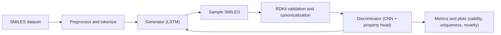
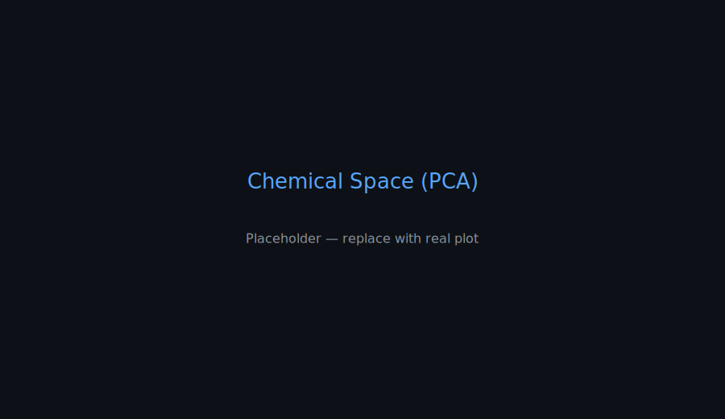

<p align="center">
  
  
  
  
</p>

<h1 align="center">🧬 Drug Discovery GAN</h1>
<p align="center">
  <b>Generate novel, valid, and diverse drug-like molecules using GANs + Reinforcement Learning</b>
</p>

<p align="center">
  <sub>Project by <a href="https://github.com/Suprith-bit">Suprith-bit</a></sub>
</p>

---

## 🚀 Overview

Drug Discovery GAN is a research-grade, end-to-end pipeline for de novo molecule generation. It combines:
- A sequence-based Generator (SMILES) built with LSTMs,
- A Discriminator with CNN feature extraction and a dual-head design (real/fake + property prediction),
- A training loop that supports supervised pretraining and GAN training enhanced with reinforcement signals,
- Robust evaluation (validity, uniqueness, novelty) and rich visualizations.

Core stack: PyTorch, RDKit, NumPy, Pandas, Matplotlib.

---

## ✨ Highlights

- 🎯 End-to-end workflow: data → training → generation → evaluation → visualization
- 🧠 Sequence Generator: `SMILESGenerator` (LSTM-based)
- 🧪 Discriminator with property head: `MolecularDiscriminator` predicts molecular properties alongside real/fake
- 🤝 Integrated model wrapper: `DrugGAN` orchestrates generator/discriminator and sampling
- 📊 Metrics: validity, uniqueness, novelty (`utils.molecular_metrics`)
- 🖼️ Visuals: Molecule grids, property distribution plots, training curves (`utils.visualization.MoleculeVisualizer`)
- ⚙️ Fully configurable via JSON (`configs/model_config.json`, `configs/training_config.json`)
- 🧰 Clean CLI in `src/main.py` to pretrain, train, generate, and evaluate

---

## 🧭 Architecture at a Glance



---

## 🖼️ Visual Gallery

The following images live in the repo under `assets/plots/` so they always display on GitHub. When you run an experiment, overwrite these placeholders with real outputs using the script below.

<p align="center">
  
  
</p>
<p align="center">
  
  
</p>
<p align="center">
  
</p>

Training curves:
<p align="center">
  
  
</p>
<p align="center">
  
</p>

---

## 🗂️ Project Structure

```
src/
  ├── data/                 # Loading, preprocessing, augmentation
  ├── models/               # Generator, Discriminator, GAN
  ├── training/             # Supervised + RL training
  ├── utils/                # Metrics, visualization
  └── main.py               # CLI entrypoint
configs/
assets/
  └── plots/                # Images used in README (committed)
data/
  ├── raw/                  # Input SMILES
  ├── processed/
  └── results/              # Experiment outputs (not referenced directly by README)
```

---

## ⚡ Quickstart

Install dependencies:
```bash
pip install -r requirements.txt
```

Train with GAN + RL:
```bash
python src/main.py --train_gan --experiment_name readme-demo
```

Generate molecules with a trained model:
```bash
python src/main.py --generate_only --load_gan data/results/readme-demo/models/trained_gan.pt
```

Copy the latest plots into the README assets (overwrites placeholders):
```bash
bash scripts/prepare_readme_assets.sh readme-demo
```

---

## 🔍 What’s Inside the Models

- Generator: `SMILESGenerator` (LSTM)
  - Embedding → LSTM (n_layers) → Linear → Token distribution
  - Temperature-controlled multinomial sampling for diversity

- Discriminator: `MolecularDiscriminator`
  - `MolecularCNN` feature extractor over token sequences
  - Heads:
    - Real/Fake classifier (GAN signal)
    - Property predictor (`PropertyPredictor`) for learning chemically meaningful features

- Integrated: `DrugGAN`
  - Orchestrates training, sampling, save/load
  - Returns valid canonical SMILES using RDKit

---

## 📊 Evaluation

Key metrics from `utils.molecular_metrics`:
- Validity: fraction of syntactically/chemically valid SMILES
- Uniqueness: fraction of unique valid molecules
- Novelty: fraction of valid unique molecules not present in training data

Outputs are written as:
- `data/results/<experiment_name>/molecules/generated_molecules.csv`
- `data/results/<experiment_name>/molecules/evaluation_results.json`
- `data/results/<experiment_name>/plots/*.png`

Run the helper script to mirror plots into `assets/plots/` for display.

---

## 🧑‍💻 What I Did (Resume‑Ready)

- Designed and implemented a full deep learning pipeline to generate de novo drug‑like molecules using GANs with reinforcement objectives, in PyTorch and RDKit.
- Built an LSTM‑based SMILES generator and a CNN‑based discriminator with dual heads for adversarial training and molecular property prediction.
- Engineered data ingestion, validation, and preprocessing for large SMILES datasets, including canonicalization and augmentation.
- Implemented rigorous evaluation (validity, uniqueness, novelty) and integrated RDKit property computations for scientific relevance.
- Automated visualization of results including molecule grids, property distributions (QED, MolWt, LogP), training curves, and chemical space projections.
- Developed a clean CLI with configurable JSONs enabling reproducible experiments, pretrained model loading, and controlled sampling.

---

## 🧰 Tech Stack

- Languages: Python
- ML/DL: PyTorch
- Cheminformatics: RDKit
- Data/Plots: NumPy, Pandas, Matplotlib

---

## 📄 License

If you plan to add a license, create a LICENSE file (e.g., MIT) and update badges accordingly.

---
